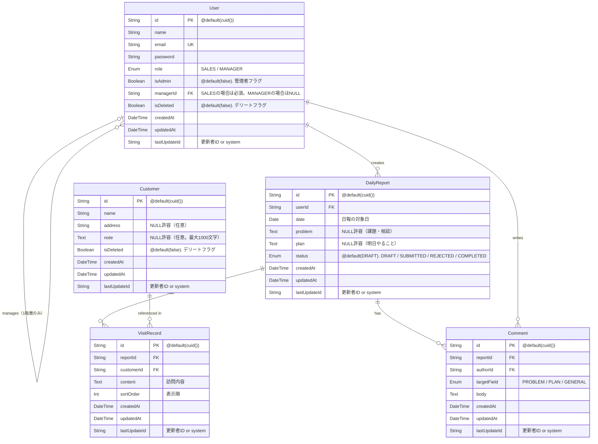

# ER図 - 日報システム

## 補足

| テーブル    | 説明                                                                                                                                |
| ----------- | ----------------------------------------------------------------------------------------------------------------------------------- |
| User        | 営業・上長を `role` で識別。管理者は `isAdmin` フラグで管理（上長が管理者を兼務可能）                                               |
| Customer    | 顧客マスタ。`isDeleted` フラグで論理削除。削除後も過去の日報・訪問記録から参照可能                                                  |
| DailyReport | 1ユーザー・1日につき1件のみ作成可能                                                                                                 |
| VisitRecord | 1日報に複数行追加可能（最大10件）。`sortOrder` で表示順を管理。保存時に1から連番で振り直す                                          |
| Comment     | `targetField` で `PROBLEM` / `PLAN` / `GENERAL` を区別。追加のみ可能（編集・削除不可）。ステータスが SUBMITTED の日報にのみ追加可能 |

## ID 生成方針

全テーブルの `id` は Prisma の `@default(cuid())` で自動生成する。

---

## 制約

| テーブル    | 制約                    | 詳細                                                                        |
| ----------- | ----------------------- | --------------------------------------------------------------------------- |
| User        | `email` UNIQUE          | メールアドレスの一意制約（ER図では `UK` マーカーで表記）                    |
| DailyReport | `(userId, date)` UNIQUE | 1ユーザー・1日につき1件のみ（複合ユニーク制約: `@@unique([userId, date])`） |

---

## lastUpdateId の方針

全テーブル共通で `lastUpdateId: String` を持つ。FK ではなく文字列型とし、以下のルールで値を設定する。

| 更新者           | 設定値                      |
| ---------------- | --------------------------- |
| ログインユーザー | そのユーザーの `id`（cuid） |
| システム自動処理 | `"system"`                  |

> アプリ層で設定する。Prisma ミドルウェアで共通処理として実装する。

---

## 論理削除の方針

| テーブル | フラグ      | 削除後の挙動                                                                                                                    |
| -------- | ----------- | ------------------------------------------------------------------------------------------------------------------------------- |
| User     | `isDeleted` | マスタ一覧・ログインから除外。過去の日報・コメントでは氏名を引き続き表示。管理者は自分自身を削除不可。最後の MANAGER は削除不可 |
| Customer | `isDeleted` | マスタ一覧・日報作成時の顧客選択から除外。過去の訪問記録では顧客名を引き続き表示                                                |

> **実装方針**: `VisitRecord` や `DailyReport` を取得する際は、JOIN先の `User`・`Customer` に対して `isDeleted` フィルタを**かけない**。一覧・選択肢表示時のみ `isDeleted = false` で絞り込む。

## ステータス定義

| 値          | 意味               |
| ----------- | ------------------ |
| `DRAFT`     | 下書き             |
| `SUBMITTED` | 提出済（承認待ち） |
| `REJECTED`  | 差し戻し           |
| `COMPLETED` | 承認済・完了       |
