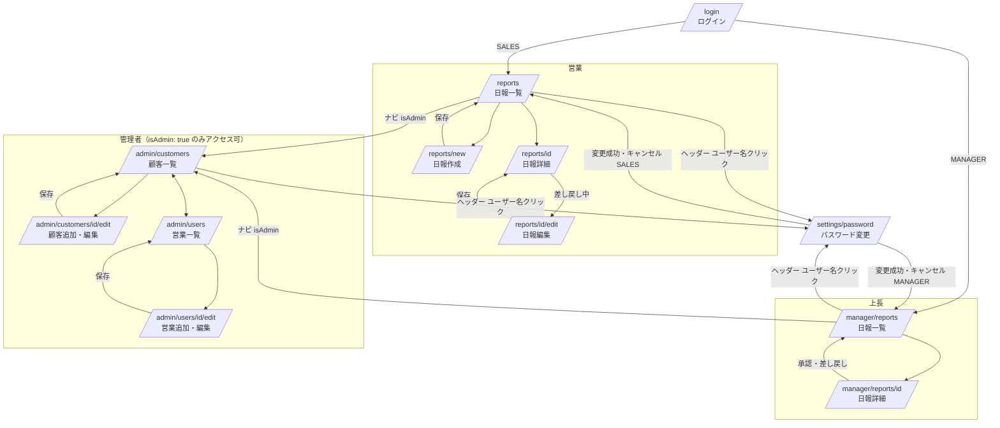

# 画面定義書 - 日報システム

**バージョン**: 1.0  
**作成日**: 2026-05-18

---

## 画面一覧

| 画面ID | 画面名           | URL                                                 | アクセス権限   |
| ------ | ---------------- | --------------------------------------------------- | -------------- |
| SC001  | ログイン         | `/login`                                            | 全員（未認証） |
| SC002  | 日報一覧（営業） | `/reports`                                          | SALES          |
| SC003  | 日報作成         | `/reports/new`                                      | SALES          |
| SC004  | 日報編集         | `/reports/[id]/edit`                                | SALES          |
| SC005  | 日報詳細（営業） | `/reports/[id]`                                     | SALES          |
| SC006  | 日報一覧（上長） | `/manager/reports`                                  | MANAGER        |
| SC007  | 日報詳細（上長） | `/manager/reports/[id]`                             | MANAGER        |
| SC008  | 顧客マスタ一覧   | `/admin/customers`                                  | isAdmin        |
| SC009  | 顧客追加・編集   | `/admin/customers/new` `/admin/customers/[id]/edit` | isAdmin        |
| SC010  | 営業マスタ一覧   | `/admin/users`                                      | isAdmin        |
| SC011  | 営業追加・編集   | `/admin/users/new` `/admin/users/[id]/edit`         | isAdmin        |
| SC012  | パスワード変更   | `/settings/password`                                | 認証済み       |

---

## 画面遷移図



---

## 各画面定義

---

### SC001. ログイン画面

**URL**: `/login`  
**アクセス**: 未認証ユーザーのみ（認証済みはロール別トップにリダイレクト）

#### レイアウト

```
┌─────────────────────────────────┐
│                                 │
│          日報システム            │
│                                 │
│  メールアドレス                  │
│  ┌───────────────────────────┐  │
│  └───────────────────────────┘  │
│                                 │
│  パスワード                      │
│  ┌───────────────────────────┐  │
│  └───────────────────────────┘  │
│                                 │
│         [  ログイン  ]           │
│                                 │
└─────────────────────────────────┘
```

#### 表示項目

| 項目           | 種別           | 備考 |
| -------------- | -------------- | ---- |
| メールアドレス | テキスト入力   | 必須 |
| パスワード     | パスワード入力 | 必須 |
| ログインボタン | ボタン         | -    |

#### バリデーション

- メールアドレス: 必須・メール形式
- パスワード: 必須

#### アクション

| アクション              | 遷移先                         |
| ----------------------- | ------------------------------ |
| ログイン成功（SALES）   | `/reports`                     |
| ログイン成功（MANAGER） | `/manager/reports`             |
| ログイン失敗            | エラーメッセージ表示（同画面） |

> `isAdmin: true` のユーザーはロールに応じたトップ画面に遷移する。管理者画面（顧客一覧・営業一覧）へはナビゲーションメニューから遷移する。

---

### SC002. 日報一覧（営業）

**URL**: `/reports`  
**アクセス**: SALES

#### レイアウト

```
┌────────────────────────────────────────────────┐
│ 日報システム  [日報一覧]  山田 太郎  [ログアウト] │
├────────────────────────────────────────────────┤
│ 日報一覧                      [+ 日報を作成]   │
│ ステータス: [全て ▼]  [04/19] 〜 [05/19]       │
├─────────────┬─────────────┬────────────────────┤
│ 日付        │ ステータス   │                    │
├─────────────┼─────────────┼────────────────────┤
│ 2026/05/18  │  完了        │                  > │
│ 2026/05/17  │  提出済      │                  > │
│ 2026/05/16  │  差し戻し    │                  > │
│ 2026/05/15  │  下書き      │                  > │
└─────────────┴─────────────┴────────────────────┘
```

#### 表示項目

| 項目           | 備考                                         |
| -------------- | -------------------------------------------- |
| 日付           | 降順ソート                                   |
| ステータス     | バッジ表示（下書き／提出済／差し戻し／完了） |
| 日報作成ボタン | -                                            |

#### フィルタ

- ステータス（全て／下書き／提出済／差し戻し／完了）
- 日付範囲（開始日・終了日）。**初期値: 直近30日（当日から過去30日間）**

#### アクション

| アクション         | 遷移先          |
| ------------------ | --------------- |
| 日報作成ボタン押下 | `/reports/new`  |
| 行クリック         | `/reports/[id]` |

#### ページネーション

- 1ページあたり20件表示
- ページ切り替えボタン（前へ / 次へ / ページ番号）を一覧下部に表示
- フィルタ変更時はページ1にリセット

---

### SC003. 日報作成画面

**URL**: `/reports/new`  
**アクセス**: SALES

#### レイアウト

```
┌────────────────────────────────────────────────┐
│ 日報システム  [日報一覧]  山田 太郎  [ログアウト] │
├────────────────────────────────────────────────┤
│ 日報作成                                       │
│                                                │
│ 日付 *  [2026/05/18 📅]                        │
│                                                │
│ 訪問記録                                       │
│                      [+ 訪問記録を追加]         │
│                                                │
│ Problem（課題・相談）                           │
│ ┌────────────────────────────────────────────┐ │
│ │                                            │ │
│ └────────────────────────────────────────────┘ │
│                                                │
│ Plan（明日やること）                            │
│ ┌────────────────────────────────────────────┐ │
│ │                                            │ │
│ └────────────────────────────────────────────┘ │
│                                                │
│  [キャンセル]      [下書き保存]      [提出]     │
└────────────────────────────────────────────────┘
```

#### 表示項目

| 項目                  | 種別                   | 必須              | 備考                                                                                                                                  |
| --------------------- | ---------------------- | ----------------- | ------------------------------------------------------------------------------------------------------------------------------------- |
| 日付                  | 日付ピッカー           | ○                 | デフォルト: 今日。未来日は選択不可                                                                                                    |
| 訪問記録              | 複数行入力エリア       | -                 | 顧客選択＋訪問内容のセット。行の追加・削除可能（最大10件）。0件のまま提出可。10件に達したら「訪問記録を追加」ボタンを disabled にする |
| ↳ 顧客                | オートコンプリート入力 | ○（行がある場合） | 顧客名を入力して絞り込み選択（GET /customers?name= を使用）。削除済み顧客は非表示                                                     |
| ↳ 訪問内容            | テキストエリア         | ○（行がある場合） | -                                                                                                                                     |
| Problem（課題・相談） | テキストエリア         | -                 | -                                                                                                                                     |
| Plan（明日やること）  | テキストエリア         | -                 | -                                                                                                                                     |
| 下書き保存ボタン      | ボタン                 | -                 | ステータス: DRAFT                                                                                                                     |
| 提出ボタン            | ボタン                 | -                 | ステータス: SUBMITTED                                                                                                                 |

#### バリデーション

- 日付: 必須・未来日不可・重複不可（同日の日報が既存の場合エラー）
- 訪問記録が1行以上ある場合、顧客・訪問内容は両方必須

#### アクション

| アクション | 遷移先                                |
| ---------- | ------------------------------------- |
| 下書き保存 | `/reports/[id]`（作成した日報の詳細） |
| 提出       | `/reports/[id]`                       |
| キャンセル | `/reports`                            |

---

### SC004. 日報編集画面

**URL**: `/reports/[id]/edit`  
**アクセス**: SALES（自分の日報かつステータスが DRAFT または REJECTED のみ）

#### レイアウト

SC003 と同じ。既存データを初期値として表示。

#### 表示項目

SC003 と同じ。既存データを初期値として表示。日付ピッカーは編集時も変更可能。

#### バリデーション

- SC003 と同じ
- 日付の重複チェック（E202）は**編集対象の日報自身を除外**して判定する

#### アクション

| アクション     | 遷移先          |
| -------------- | --------------- |
| 下書き保存     | `/reports/[id]` |
| 提出（再提出） | `/reports/[id]` |
| キャンセル     | `/reports/[id]` |

---

### SC005. 日報詳細（営業）

**URL**: `/reports/[id]`  
**アクセス**: SALES（自分の日報のみ）

#### レイアウト

```
┌────────────────────────────────────────────────┐
│ 日報システム  [日報一覧]  山田 太郎  [ログアウト] │
├────────────────────────────────────────────────┤
│ [< 一覧に戻る]                                 │
│ 2026/05/18   差し戻し                  [編集]  │
├────────────────────────────────────────────────┤
│ 訪問記録                                       │
│  株式会社〇〇    新製品の提案を実施             │
│  △△商事        契約更新の打ち合わせ            │
├────────────────────────────────────────────────┤
│ Problem（課題・相談）                           │
│  〇〇の件について検討が必要                     │
│                                                │
│  ┌ 上長コメント ─────────────────────────────┐ │
│  │ 来週までに対応方針を確認してください        │ │
│  └────────────────────────────────────────────┘ │
├────────────────────────────────────────────────┤
│ Plan（明日やること）                            │
│  △△商事へのフォローアップ                      │
│                                                │
│  ┌ 上長コメント ─────────────────────────────┐ │
│  │ 先方の担当者を確認してから連絡を            │ │
│  └────────────────────────────────────────────┘ │
└────────────────────────────────────────────────┘
```

#### 表示項目

| 項目                 | 備考                                                      |
| -------------------- | --------------------------------------------------------- |
| 日付                 | -                                                         |
| ステータス           | バッジ表示                                                |
| 訪問記録一覧         | 顧客名・訪問内容を行ごとに表示                            |
| Problem              | テキスト表示                                              |
| ↳ 上長コメント       | Problemへのコメントがあれば表示。ステータス問わず常時表示 |
| Plan                 | テキスト表示                                              |
| ↳ 上長コメント       | Planへのコメントがあれば表示。ステータス問わず常時表示    |
| 上長コメント（全般） | GENERALコメントがあれば表示。ステータス問わず常時表示     |

#### アクション

| アクション | 表示条件              | 遷移先               |
| ---------- | --------------------- | -------------------- |
| 編集ボタン | DRAFT または REJECTED | `/reports/[id]/edit` |
| 一覧に戻る | 常時                  | `/reports`           |

---

### SC006. 日報一覧（上長）

**URL**: `/manager/reports`  
**アクセス**: MANAGER

#### レイアウト

```
┌────────────────────────────────────────────────┐
│ 日報システム  [日報一覧]  [顧客マスタ] [営業マスタ]  鈴木 部長 [ログアウト] │
├────────────────────────────────────────────────┤
│ 部下の日報一覧                                  │
│ 営業: [全員 ▼]  ステータス: [提出済 ▼]          │
│ [04/19] 〜 [05/19]                             │
├─────────────┬─────────────┬────────────────────┤
│ 日付        │ 営業氏名     │ ステータス          │
├─────────────┼─────────────┼────────────────────┤
│ 2026/05/18  │ 山田 太郎   │  提出済           > │
│ 2026/05/18  │ 佐藤 次郎   │  提出済           > │
│ 2026/05/17  │ 山田 太郎   │  完了             > │
└─────────────┴─────────────┴────────────────────┘
```

#### 表示項目

| 項目       | 備考       |
| ---------- | ---------- |
| 営業氏名   | -          |
| 日付       | 降順ソート |
| ステータス | バッジ表示 |

#### フィルタ

- 営業（配下の営業で絞り込み）
- ステータス（全て／提出済／差し戻し／完了）
- 日付範囲。**初期値: 直近30日（当日から過去30日間）**

#### アクション

| アクション | 遷移先                  |
| ---------- | ----------------------- |
| 行クリック | `/manager/reports/[id]` |

#### ページネーション

- 1ページあたり20件表示
- ページ切り替えボタン（前へ / 次へ / ページ番号）を一覧下部に表示
- フィルタ変更時はページ1にリセット

---

### SC007. 日報詳細（上長）

**URL**: `/manager/reports/[id]`  
**アクセス**: MANAGER（配下営業の日報のみ）

#### レイアウト

```
┌────────────────────────────────────────────────┐
│ 日報システム  [日報一覧]  [顧客マスタ] [営業マスタ]  鈴木 部長 [ログアウト] │
├────────────────────────────────────────────────┤
│ [< 一覧に戻る]                                 │
│ 山田 太郎  2026/05/18   提出済                 │
│                      [差し戻し]   [承認]        │
├────────────────────────────────────────────────┤
│ 訪問記録                                       │
│  株式会社〇〇    新製品の提案を実施             │
│  △△商事        契約更新の打ち合わせ            │
├────────────────────────────────────────────────┤
│ Problem（課題・相談）                           │
│  〇〇の件について検討が必要                     │
│                                                │
│  コメント                                      │
│  ┌──────────────────────────────────────────┐  │
│  └──────────────────────────────────────────┘  │
│                                      [送信]    │
├────────────────────────────────────────────────┤
│ Plan（明日やること）                            │
│  △△商事へのフォローアップ                      │
│                                                │
│  コメント                                      │
│  ┌──────────────────────────────────────────┐  │
│  └──────────────────────────────────────────┘  │
│                                      [送信]    │
├────────────────────────────────────────────────┤
│ 全般コメント                                    │
│  ┌──────────────────────────────────────────┐  │
│  │                                          │  │
│  └──────────────────────────────────────────┘  │
│                                      [送信]    │
└────────────────────────────────────────────────┘
```

#### 表示項目

| 項目                       | 備考                                               |
| -------------------------- | -------------------------------------------------- |
| 営業氏名・日付・ステータス | -                                                  |
| 訪問記録一覧               | 顧客名・訪問内容を行ごとに表示                     |
| Problem                    | テキスト表示                                       |
| ↳ 過去コメント             | ステータス問わず常時表示                           |
| ↳ コメント入力欄           | SUBMITTED のみ表示。SUBMITTED 以外は入力欄を非表示 |
| Plan                       | テキスト表示                                       |
| ↳ 過去コメント             | ステータス問わず常時表示                           |
| ↳ コメント入力欄           | SUBMITTED のみ表示。SUBMITTED 以外は入力欄を非表示 |
| 全般コメント（過去）       | ステータス問わず常時表示                           |
| 全般コメント入力欄         | SUBMITTED のみ表示。SUBMITTED 以外は入力欄を非表示 |

#### アクション

| アクション     | 表示条件       | 遷移先                                      | 備考                           |
| -------------- | -------------- | ------------------------------------------- | ------------------------------ |
| 承認ボタン     | SUBMITTED      | `/manager/reports`（ステータス: COMPLETED） | 確認ダイアログあり             |
| 差し戻しボタン | SUBMITTED      | `/manager/reports`（ステータス: REJECTED）  | 確認ダイアログあり             |
| コメント送信   | SUBMITTED のみ | 同画面（コメント追加）                      | SUBMITTED 以外は入力欄を非表示 |
| 一覧に戻る     | 常時           | `/manager/reports`                          | -                              |

---

### SC008. 顧客マスタ一覧

**URL**: `/admin/customers`  
**アクセス**: isAdmin

#### レイアウト

```
┌────────────────────────────────────────────────┐
│ 日報システム  [日報一覧]  [顧客マスタ] [営業マスタ]  鈴木 部長 [ログアウト] │
├────────────────────────────────────────────────┤
│ 顧客マスタ                      [+ 顧客を追加] │
│ 顧客名: [              🔍]                     │
├──────────────┬──────────────┬──────┬───────────┤
│ 顧客名       │ 住所          │ 備考 │           │
├──────────────┼──────────────┼──────┼───────────┤
│ 株式会社〇〇  │ 東京都〇〇区  │  -   │[編集][削除]│
│ △△商事      │ 大阪府△△市  │ VIP  │[編集][削除]│
└──────────────┴──────────────┴──────┴───────────┘
```

#### 表示項目

| 項目           | 備考                       |
| -------------- | -------------------------- |
| 顧客名         | -                          |
| 住所           | -                          |
| 備考           | -                          |
| 編集ボタン     | 行ごと                     |
| 削除ボタン     | 行ごと。確認ダイアログあり |
| 顧客追加ボタン | -                          |

#### フィルタ

- 顧客名（テキスト検索）

#### アクション

| アクション     | 遷移先                                       |
| -------------- | -------------------------------------------- |
| 顧客追加ボタン | `/admin/customers/new`                       |
| 編集ボタン     | `/admin/customers/[id]/edit`                 |
| 削除ボタン     | 確認ダイアログ → `isDeleted: true`（同画面） |

#### ページネーション

- 1ページあたり20件表示
- ページ切り替えボタン（前へ / 次へ / ページ番号）を一覧下部に表示
- 検索フィルタ変更時はページ1にリセット

---

### SC009. 顧客追加・編集画面

**URL**: `/admin/customers/new` / `/admin/customers/[id]/edit`  
**アクセス**: isAdmin

> 画面タイトルは新規追加時「顧客追加」、編集時（`/[id]/edit`）「顧客編集」に切り替える。

#### レイアウト

```
┌────────────────────────────────────────────────┐
│ 日報システム  [日報一覧]  [顧客マスタ] [営業マスタ]  鈴木 部長 [ログアウト] │
├────────────────────────────────────────────────┤
│ 顧客追加 / 顧客編集（モードに応じて切り替え）  │
│                                                │
│ 顧客名 *                                       │
│ ┌────────────────────────────────────────────┐ │
│ └────────────────────────────────────────────┘ │
│ 住所                                           │
│ ┌────────────────────────────────────────────┐ │
│ └────────────────────────────────────────────┘ │
│ 備考                                           │
│ ┌────────────────────────────────────────────┐ │
│ │                                            │ │
│ └────────────────────────────────────────────┘ │
│                                                │
│               [キャンセル]      [保存]          │
└────────────────────────────────────────────────┘
```

#### 表示項目

| 項目             | 種別           | 必須 |
| ---------------- | -------------- | ---- |
| 顧客名           | テキスト入力   | ○    |
| 住所             | テキスト入力   | -    |
| 備考             | テキストエリア | -    |
| 保存ボタン       | ボタン         | -    |
| キャンセルボタン | ボタン         | -    |

#### アクション

| アクション | 遷移先             |
| ---------- | ------------------ |
| 保存       | `/admin/customers` |
| キャンセル | `/admin/customers` |

---

### SC010. 営業マスタ一覧

**URL**: `/admin/users`  
**アクセス**: isAdmin

#### レイアウト

```
┌────────────────────────────────────────────────────────────┐
│ 日報システム  [日報一覧]  [顧客マスタ] [営業マスタ]  鈴木 部長 [ログアウト] │
├────────────────────────────────────────────────────────────┤
│ 営業マスタ                              [+ 営業を追加]      │
│ 氏名: [              🔍]  ロール: [全て ▼]                  │
├──────────┬──────────────────────┬────────┬──────┬──────────┤
│ 氏名     │ メールアドレス        │ ロール │管理者│ 上長     │
├──────────┼──────────────────────┼────────┼──────┼──────────┤
│ 山田 太郎│ yamada@example.com   │ SALES  │  -   │ 鈴木 部長│[編集][削除]│
│ 鈴木 部長│ suzuki@example.com   │MANAGER │  ○  │  -       │[編集][削除]│
└──────────┴──────────────────────┴────────┴──────┴──────────┘
```

#### 表示項目

| 項目           | 備考                                                                        |
| -------------- | --------------------------------------------------------------------------- |
| 氏名           | -                                                                           |
| メールアドレス | -                                                                           |
| ロール         | SALES / MANAGER                                                             |
| 管理者フラグ   | ○ / -                                                                       |
| 上長氏名       | SALES のみ表示                                                              |
| 編集ボタン     | 行ごと                                                                      |
| 削除ボタン     | 行ごと。確認ダイアログあり。自分自身・最後のMANAGERは削除不可（エラー表示） |
| 営業追加ボタン | -                                                                           |

#### フィルタ

- 氏名（テキスト検索）
- ロール（全て／SALES／MANAGER）

#### アクション

| アクション     | 遷移先                                       |
| -------------- | -------------------------------------------- |
| 営業追加ボタン | `/admin/users/new`                           |
| 編集ボタン     | `/admin/users/[id]/edit`                     |
| 削除ボタン     | 確認ダイアログ → `isDeleted: true`（同画面） |

#### ページネーション

- 1ページあたり20件表示
- ページ切り替えボタン（前へ / 次へ / ページ番号）を一覧下部に表示
- 検索フィルタ変更時はページ1にリセット

---

### SC011. 営業追加・編集画面

**URL**: `/admin/users/new` / `/admin/users/[id]/edit`  
**アクセス**: isAdmin

> 画面タイトルは新規追加時「営業追加」、編集時（`/[id]/edit`）「営業編集」に切り替える。

#### レイアウト

```
┌────────────────────────────────────────────────┐
│ 日報システム  [日報一覧]  [顧客マスタ] [営業マスタ]  鈴木 部長 [ログアウト] │
├────────────────────────────────────────────────┤
│ 営業追加 / 営業編集（モードに応じて切り替え）  │
│                                                │
│ 氏名 *                                         │
│ ┌────────────────────────────────────────────┐ │
│ └────────────────────────────────────────────┘ │
│ メールアドレス *                                │
│ ┌────────────────────────────────────────────┐ │
│ └────────────────────────────────────────────┘ │
│ ロール *                                       │
│ ( ) SALES   ( ) MANAGER                        │
│ 管理者フラグ                                    │
│ [ ] 管理者権限を付与する                        │
│ 上長（ロールが SALES の場合のみ表示）           │
│ ┌────────────────────────────────────────────┐ │
│ │  選択してください                    ▼     │ │
│ └────────────────────────────────────────────┘ │
│                                                │
│               [キャンセル]      [保存]          │
└────────────────────────────────────────────────┘
```

#### 表示項目

| 項目                     | 種別             | 必須           | 備考                                                                                                                                                                    |
| ------------------------ | ---------------- | -------------- | ----------------------------------------------------------------------------------------------------------------------------------------------------------------------- |
| 氏名                     | テキスト入力     | ○              | -                                                                                                                                                                       |
| メールアドレス           | テキスト入力     | ○              | 一意制約。編集時は変更不可（表示のみ）                                                                                                                                  |
| ロール                   | セレクトボックス | ○              | SALES / MANAGER                                                                                                                                                         |
| 管理者フラグ             | チェックボックス | -              | -                                                                                                                                                                       |
| 上長                     | セレクトボックス | ○（SALESのみ） | ロールがSALESの場合のみ表示かつ必須。`isDeleted: false` のMANAGERのみ選択肢に表示。ロールをMANAGERに変更した場合は非表示になり、保存時に `managerId: null` でクリアする |
| パスワードリセットボタン | ボタン           | -              | **編集時のみ表示**。押下で確認ダイアログ → 新しい初期パスワードを発行・表示                                                                                             |
| 保存ボタン               | ボタン           | -              | -                                                                                                                                                                       |
| キャンセルボタン         | ボタン           | -              | -                                                                                                                                                                       |

> 新規追加時は初期パスワードを自動発行し、画面に表示する（管理者がユーザーに共有する運用）。

#### バリデーション

- メールアドレス: 必須・メール形式・一意
- ロールが SALES の場合、上長は必須

#### アクション

| アクション | 遷移先         |
| ---------- | -------------- |
| 保存       | `/admin/users` |
| キャンセル | `/admin/users` |

---

### SC012. パスワード変更画面

**URL**: `/settings/password`  
**アクセス**: 認証済みユーザー（全ロール）

> **遷移経路**: 全ロールの画面共通ヘッダーでユーザー名をクリックするとドロップダウンメニューが表示され、「パスワード変更」を選択してアクセスする。

#### レイアウト

```
┌────────────────────────────────────────────────┐
│ 日報システム  [日報一覧]  山田 太郎  [ログアウト] │
├────────────────────────────────────────────────┤
│ パスワード変更                                  │
│                                                │
│ 現在のパスワード *                              │
│ ┌────────────────────────────────────────────┐ │
│ └────────────────────────────────────────────┘ │
│                                                │
│ 新しいパスワード *                              │
│ ┌────────────────────────────────────────────┐ │
│ └────────────────────────────────────────────┘ │
│                                                │
│ 新しいパスワード（確認） *                      │
│ ┌────────────────────────────────────────────┐ │
│ └────────────────────────────────────────────┘ │
│                                                │
│               [キャンセル]      [変更する]      │
└────────────────────────────────────────────────┘
```

#### 表示項目

| 項目                     | 種別           | 必須 | 備考                   |
| ------------------------ | -------------- | ---- | ---------------------- |
| 現在のパスワード         | パスワード入力 | ○    | -                      |
| 新しいパスワード         | パスワード入力 | ○    | 8文字以上・英数字混在  |
| 新しいパスワード（確認） | パスワード入力 | ○    | 新しいパスワードと一致 |
| 変更するボタン           | ボタン         | -    | -                      |
| キャンセルボタン         | ボタン         | -    | -                      |

#### バリデーション

- 現在のパスワード: 必須・DB保存値と一致
- 新しいパスワード: 必須・8文字以上・英字と数字を両方含む
- 確認パスワード: 必須・新しいパスワードと一致

#### アクション

| アクション            | 遷移先             |
| --------------------- | ------------------ |
| 変更成功（SALES）     | `/reports`         |
| 変更成功（MANAGER）   | `/manager/reports` |
| キャンセル（SALES）   | `/reports`         |
| キャンセル（MANAGER） | `/manager/reports` |
